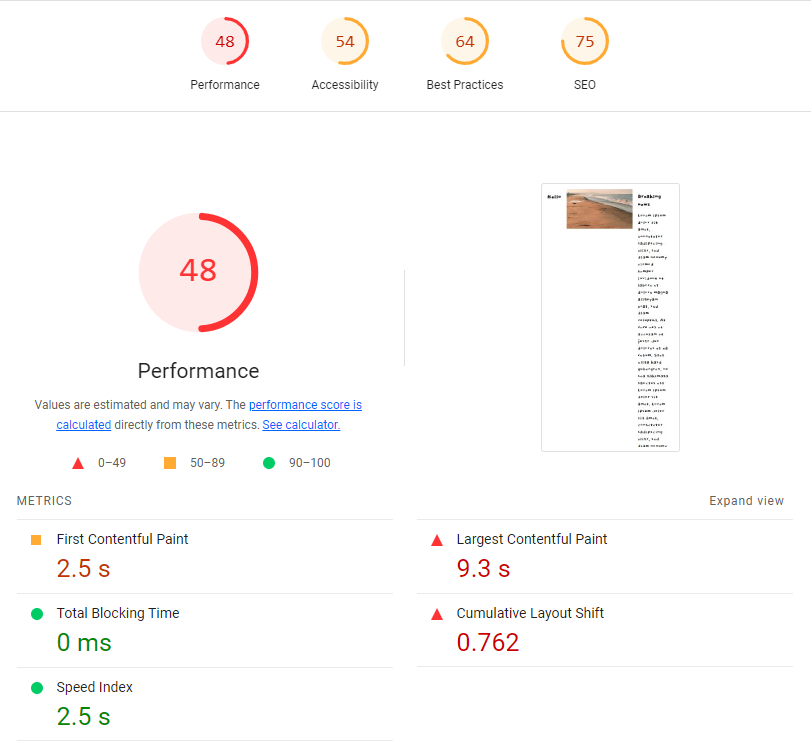
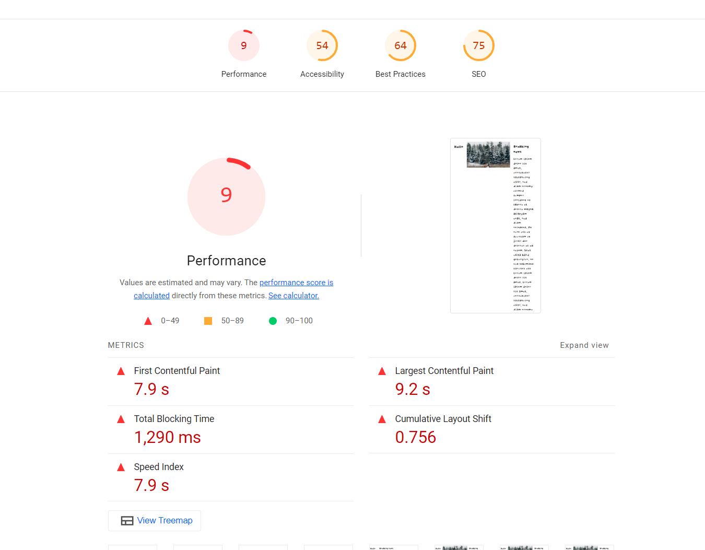

This repository contains a static web page with some typical performance. Source: https://github.com/jschroeter/hdm-webperformance

## Lighthouse report

The goal is to optimize the application to have better web vitals score

## Exercise

- open the page with a slow internet connection (e.g. network throtteling of browser dev tools) and observe how the page loads and renders
- run and check web performance analysis with tools like https://web.dev/measure/, https://WebPageTest.org and Lighthouse
- implement improvements

## Ligthhouse report over changes

- make performance worst:
  
