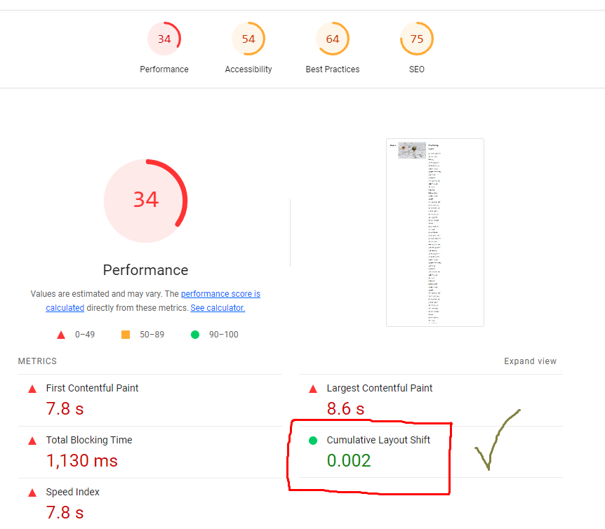
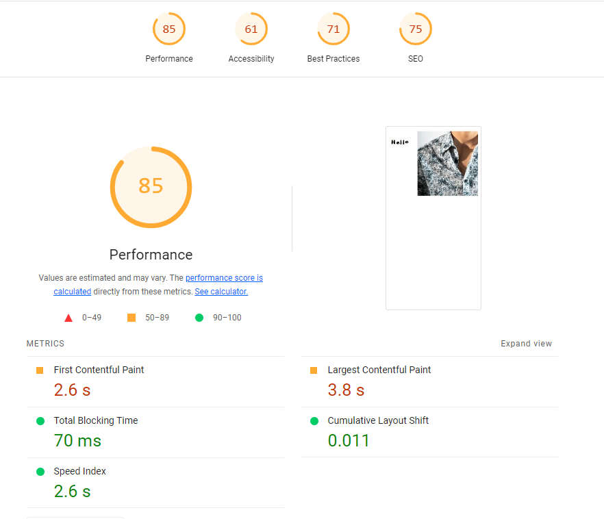
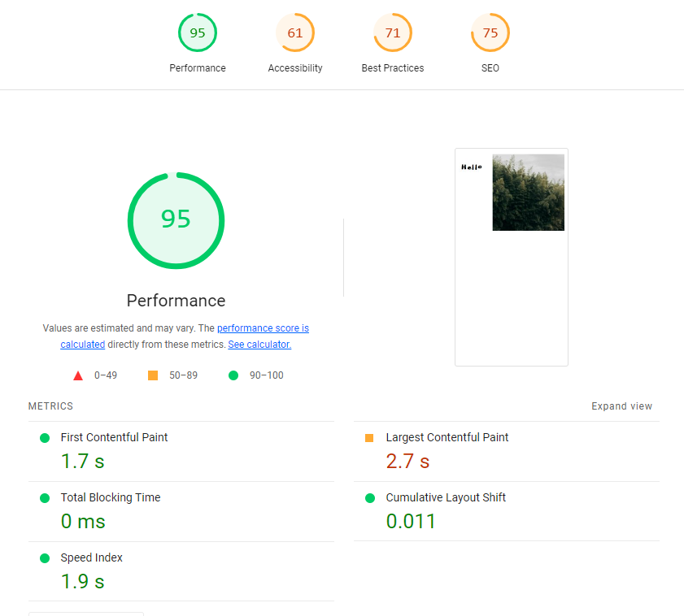
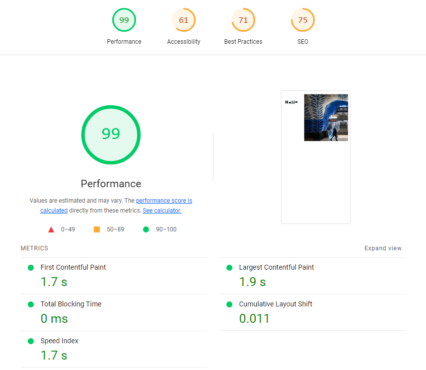
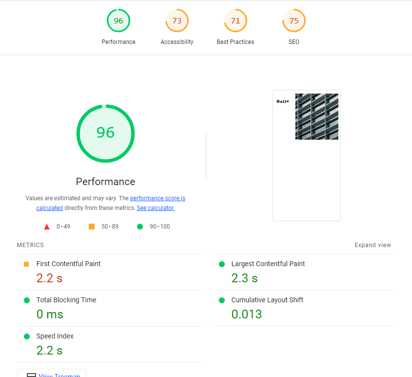
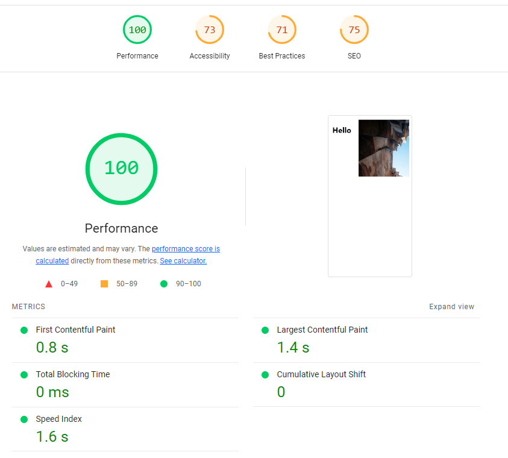
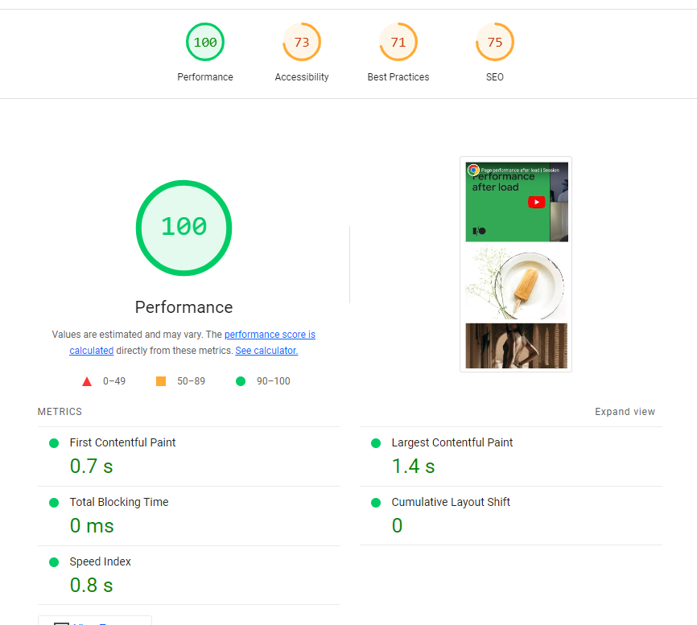

This repository contains a static web page with some typical performance. Source: https://github.com/jschroeter/hdm-webperformance

## Lighthouse report

The goal is to optimize the application to have better web vitals score

## Exercise

- open the page with a slow internet connection (e.g. network throtteling of browser dev tools) and observe how the page loads and renders
- run and check web performance analysis with tools like https://web.dev/measure/, https://WebPageTest.org and Lighthouse
- implement improvements

## Ligthhouse report over changes

- make performance worst:
  
- correct images layout shift
  
- add web worker for heavy task 

- change google analytics to asynchronous , change css order , defer for jquery file

- Add async ro remove rendering blocking resources, minify jquery , default fonts

- minify jquery, add lazy load, update font usage 

- add fonts in the server, minify css 

- optomize images , correct css 
